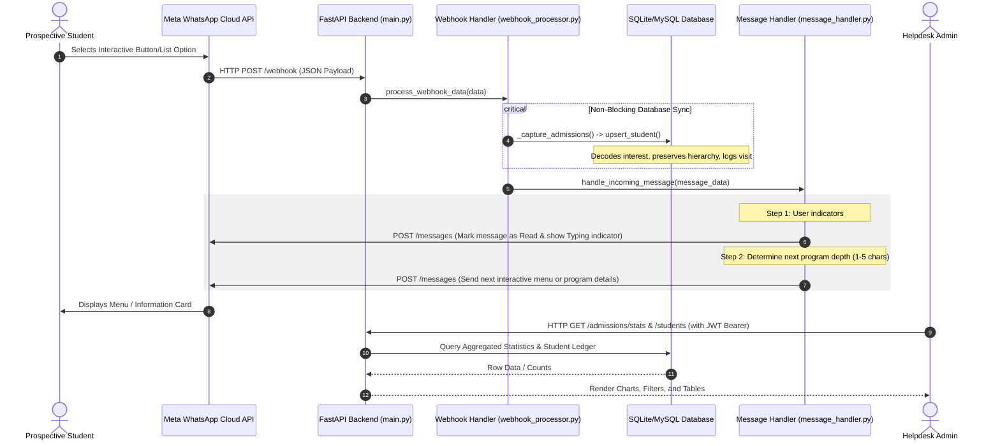

# 02. System Architecture

The GMU Admissions platform consists of two main pillars:
1. **The WhatsApp Interactive Pipeline**: An asynchronous, event-driven webhook handler that parses incoming events, updates databases, and sends automated responses.
2. **The Administration Panel (Vite + React SPA)**: A secure management dashboard served via the FastAPI static mount.

---

## 🔄 Interaction Flow Diagram

Below is the sequence of events from when a prospective student sends a message on WhatsApp to when it updates the database and sends a reply, alongside how the admin dashboard views this data.

---

## 🛠️ Component Walkthrough

### 1. Inbound Webhook Endpoint (`routes/webhook.py`)
*   **Verification**: Handles the `GET` handshake requested by Meta using a secure `VERIFY_TOKEN` defined in the environment.
*   **Reception**: Receives a `POST` request containing a nested JSON body representing status updates (delivered, read) or messages (text, interactive buttons, list selections).

### 2. Payload Parser & Extractor (`processors/webhook_processor.py`)
*   Normalizes the complex, deeply nested JSON schema from Meta into a flat, predictable Python dictionary (`message_data`).
*   Splits processing between delivery status callbacks and incoming user messages.
*   Triggers the admissions logging sub-process silently inside a `try/except` block, ensuring database hiccups never crash the core WhatsApp chat flow.

### 3. Messaging Engine (`handlers/message_handler.py` & `meta/send_main.py`)
*   **User Feedback**: Triggers typing indicators immediately to create a realistic, responsive user experience.
*   **Menu Routing**: Inspects the length and characters of incoming button/list reply IDs:
    *   **Text Message / Unknown**: Responds with the **Welcome Menu** (UG, PG, Website buttons).
    *   **1 Character** (e.g., `a` or `b`): Sends **UG or PG Faculty details** (via List menu).
    *   **2 Characters** (e.g., `aa` or `ba`): Sends the **School details** (via Buttons).
    *   **3 Characters** (e.g., `aaa` or `baa`): Sends the **Branch details** (via List menu).
    *   **4 Characters** (e.g., `aaaa` or `baaa`): Sends the **Course details / Action menu** (Program details, Fee & Duration, Visit Web page).
    *   **5 Characters** (e.g., `aaaaa`): Returns the specific text summary, fee structure, or links.

### 4. SPA Hosting (`main.py`)
*   FastAPI mounts the production build of the React project (located in `dashboard/dist`) using `StaticFiles`.
*   Includes wildcard routing (`/dashboard/{full_path:path}`) returning `index.html` to support frontend client-side routing (React Router) without backend page refresh issues.
