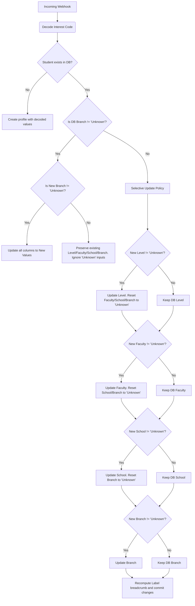

# 03. Database Design & State Preservation Logic

The platform supports a dual-database design, defaulting to **SQLite** for rapid development and local deployment, while providing drop-in support for **MySQL** (via `pymysql` cursor adapters) by toggling the `DB_TYPE` environment variable.

---

## 📊 Database Schema

The database consists of two tables: one representing the **Student Ledger** (unique prospect profiles) and another logging **Visit History** (detailed chronological activity).

### 1. Unique Student Profiles (`bot_admissions_students`)
Stores the compiled profile, current interest state, aggregate visits, and metadata for each unique student.

| Column | Type (SQLite) | Type (MySQL) | Description |
| :--- | :--- | :--- | :--- |
| `id` | INTEGER | INT AUTO_INCREMENT | Primary Key. |
| `wa_id` | TEXT | VARCHAR(64) | Meta WhatsApp User Identifier (Unique Index). |
| `sender_name` | TEXT | VARCHAR(255) | Student's WhatsApp profile name. |
| `phone` | TEXT | VARCHAR(32) | Contact phone number. |
| `last_interest_code` | TEXT | VARCHAR(32) | Most recently interacted course code. |
| `last_level` | TEXT | VARCHAR(16) | E.g., `UG`, `PG`, or `Unknown`. |
| `last_faculty` | TEXT | VARCHAR(128) | Academic faculty category. |
| `last_school` | TEXT | VARCHAR(128) | Sub-school category. |
| `last_branch` | TEXT | VARCHAR(128) | Exact program of study (e.g., `Computer Science & Engineering`). |
| `last_label` | TEXT | VARCHAR(512) | Breadcrumb string: `Level › Faculty › School › Branch`. |
| `interests_json` | TEXT | JSON | Array of all distinct interest codes selected by student. |
| `visit_count` | INTEGER | INT | Total number of times they interacted with menus. |
| `first_seen` | TEXT | DATETIME | Timestamp of first interaction. |
| `last_seen` | TEXT | DATETIME | Timestamp of most recent interaction. |

### 2. Timeline Visits Table (`bot_admissions_visits`)
Tracks every single message/button click in chronological order. This powers the daily timeline charts on the admin panel.

| Column | Type (SQLite) | Type (MySQL) | Description |
| :--- | :--- | :--- | :--- |
| `id` | INTEGER | INT AUTO_INCREMENT | Primary Key. |
| `wa_id` | TEXT | VARCHAR(64) | Target WhatsApp User. |
| `interest_code` | TEXT | VARCHAR(32) | Interacted code. |
| `level` | TEXT | VARCHAR(16) | Decoded level. |
| `faculty` | TEXT | VARCHAR(128) | Decoded faculty. |
| `school` | TEXT | VARCHAR(128) | Decoded school. |
| `branch` | TEXT | VARCHAR(128) | Decoded branch. |
| `label` | TEXT | VARCHAR(512) | Decoded breadcrumb label. |
| `visited_at` | TEXT | DATETIME | Timestamp of interaction. |

---

## 🧠 State Preservation & Hierarchy Update Policy

A critical feature of this application is its **State Preservation Logic** inside `upsert_student()`. 

### The Problem
When a user navigates to a specific program (e.g., *UG › Faculty of Engineering › School of Computer Science › CSE*), the database records their specific interest. However, if that user sends a generic message (like "Hi") or presses a "Back to Main Menu" button, the webhook receives a high-level code (like `a` for UG) or no code at all.
*   **Naive Approach**: Overwriting fields with the latest decoded values would erase the specific branch details and replace them with `Unknown`, destroying the quality of the sales lead.
*   **GMU Solution**: The database engine implements a strict state-preservation filter.

### The Logic Algorithm
When a message arrives, the new interest code is decoded. The system checks the database for an existing student record:

### Key Business Value of this Logic:
*   **Prevents Loss of Depth**: Once a user qualifies themselves as a "UG Computer Science" lead, that qualification is locked in. High-level menu navigation or random messages will not degrade the lead quality.
*   **Enables Redirection**: If a user is locked into "UG CSE", but subsequently selects a *PG MBA* course code (`BFAA`), the system detects `New Branch != Unknown` and cleanly updates their profile to the new PG course.

---

## 📥 Excel-Optimized CSV Export

The export pipeline (`/admissions/export/csv`) facilitates lead distribution to sales representatives:
*   **UTF-8 BOM Header (`\ufeff`)**: Written at the beginning of the text stream, forcing Microsoft Excel to load the CSV file using UTF-8 encoding automatically. This prevents corruption of unicode delimiters (e.g. ` › `).
*   **Field Cleaning**: Extracts user-friendly values and formats them cleanly (Name, Phone, WhatsApp ID, Level, Faculty, School, Branch, Visit Counts, and Timestamps) while removing developer-facing interest codes.
