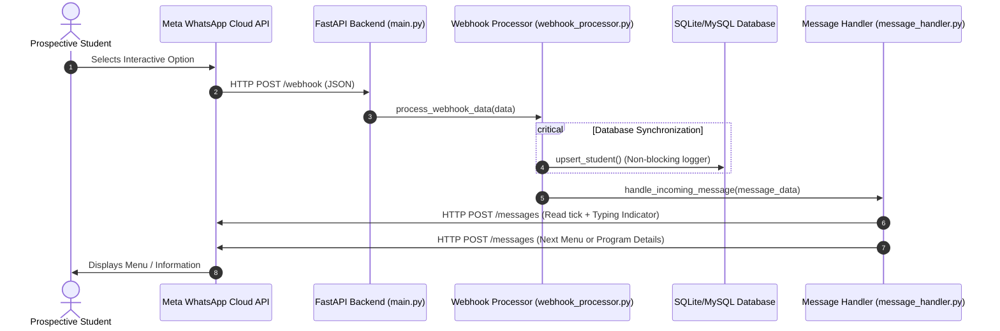

# GMU WhatsApp Admissions Platform - Technical Specification

This document provides a consolidated technical overview of the **GM University (GMU) Admissions WhatsApp Marketing Platform and Admin Dashboard**. It outlines the system architecture, database design, interest-decoding algorithms, integration specifications, and dashboard components.

---

## 1. Executive Summary & Tech Stack

The platform is designed to automate student outreach and lead capturing for GMU Admissions (2026-2027) via WhatsApp, recording interest preferences dynamically and visualizing them on an analytical dashboard.

| Component | Technology | Description |
| :--- | :--- | :--- |
| **Backend API** | FastAPI (Python 3.10+) | Asynchronous routing, middleware, and request validation. |
| **Database** | SQLite / MySQL | Dual-engine support with relation structures and row factories. |
| **Frontend** | React (Vite) + Vanilla CSS | Clean, responsive Single Page Application (SPA). |
| **Auth** | JWT (HS256) + SHA256 hashing | Secure credentials storage and request authentication. |
| **Messaging** | Meta Cloud API (v25.0) | Interactive WhatsApp messaging endpoints. |

---

## 2. System Architecture & Flow

The system runs on an asynchronous pipeline. Inbound webhook callbacks from Meta are parsed, student profiles are synchronized, and the next interactive menu or program card is dispatched to the user.

---

## 3. Database Schema & State Preservation Logic

The database tracks student details, cumulative visits, and granular level/faculty/school/branch preferences, while preventing user resets when navigating back to high-level menus.

### 3.1 Tables Schema
*   **`bot_admissions_students`**: Stores unique prospect profiles, cumulative visit counts, and final interest states.
*   **`bot_admissions_visits`**: Logs every menu interaction chronologically to populate daily engagement charts.

### 3.2 State Preservation Algorithm
To prevent high-level navigation (e.g. going back to the main menu) from overwriting detailed course interests with `Unknown`, the `upsert_student` function enforces the following update policy:
1.  **Lock-In Selection**: If a student already has a detailed branch assigned (`last_branch != 'Unknown'`), the database will **not** change any column unless they explicitly choose a new, valid branch.
2.  **Selective Updates**: If no branch is selected yet, fields (Level, Faculty, School, Branch) are updated progressively *only if* the new incoming decoded value is not `'Unknown'`. 
3.  **Breadcrumb Regeneration**: Upon update, a human-readable string is computed and stored in `last_label` (e.g. `UG › Faculty of Engineering and Technology › School of Engineering › Biotech`).

---

## 4. WhatsApp Interest Code Decoder

To bypass character limitations in WhatsApp List/Button IDs, navigation choices send compressed codes parsed by `admissions/decoder.py`.

### 4.1 Code Layout
*   **Level (Length 1)**: `A` (UG), `B` (PG)
*   **Faculty (Length 2)**: e.g., `AA` (UG Engg), `BD` (PG Commerce)
*   **School (Length 3)**: e.g., `AAA` (UG CS & Tech), `BFA` (PG MBA)
*   **Branch (Length 4)**: e.g., `AAAA` (UG CSE), `BFAA` (PG MBA General)
*   **Action Suffix (Length 5 or Conditional Length 4)**: 
    *   `a`: Program Details | `b`: Fee & Duration | `c`: Website / Link

### 4.2 Code Normalization & Aliasing
A smart length detector separates action characters from base codes (e.g. `bdcaa` is parsed as base `bdca` + action `a`). The engine maps lowercase entries, mixed-case codes (like Research `afa` -> `AFa`), and legacy aliases (like `bbce` -> `BCaA`) to ensure robustness.

---

## 5. API Payloads & Dashboard Frontend

### 5.1 Payloads (`schema/service_schema.py`)
*   **Interactive Buttons**: Used for high-level selections (max 3 buttons, max title length 20 chars).
*   **Interactive Lists**: Used for details selections (max 10 rows per section, max title length 24 chars).
*   **CTA URL Buttons**: Used to redirect users to external links (e.g., `https://gmu.ac.in/`).

### 5.2 Dashboard Pages
*   **Login**: Secure JWT retrieval; token stored in client `localStorage` and sent in HTTP Authorization headers.
*   **Overview**: Analytical dashboard displaying lead statistics, daily visitor trends (last 14 days), and interest distributions (UG vs PG, top faculties, top schools).
*   **Students Ledger**: Live lead ledger supporting searching, level/faculty filtering, pagination, and Excel-optimized CSV download (using UTF-8 BOM compatibility).
*   **Settings**: Secure interface for password updates modifying `admin_creds.json`.
